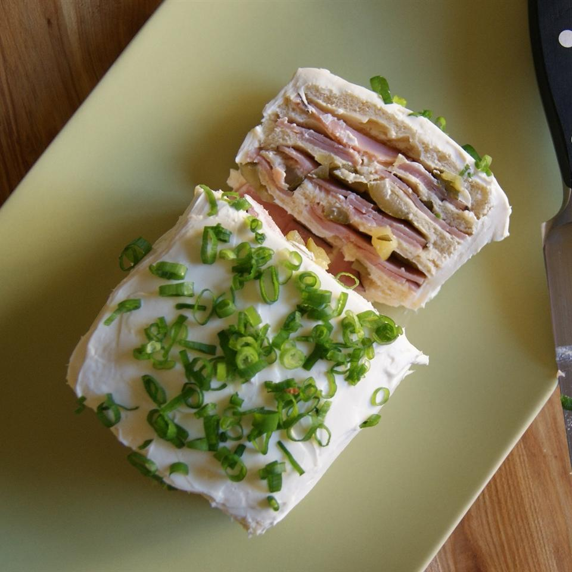

# Frosted Sandwich Loaf

This recipe is very versatile as you can use many different fillings, including thin sliced meats, seafood salad--or make up one of your own. You may use less salad dressing, if you like, in the spreads.

- [ ] 2 cups fully cooked ground ham
- [ ] ½ cup creamy salad dressing (e.g. Miracle Whip)
- [ ] 3 tablespoons sweet pickle relish
- [ ] 1 tablespoon grated onion
- [ ] 2 cups ground bologna
- [ ] 3 tablespoons sweet pickle relish
- [ ] ½ cup creamy salad dressing (e.g. Miracle Whip)
- [ ] 1 (8 ounce) package cream cheese, softened
- [ ] ⅓ cup finely chopped walnuts
- [ ] 3 tablespoons pimento-stuffed green olives, chopped
- [ ] 2 tablespoons milk
- [ ] 2 cups shredded Cheddar cheese
- [ ] 1 (8 ounce) package cream cheese, softened
- [ ] 3 tablespoons creamy salad dressing (e.g. Miracle Whip)
- [ ] ⅛ teaspoon onion salt
- [ ] ⅛ teaspoon garlic salt
- [ ] ⅛ teaspoon celery salt
- [ ] 2 (8 ounce) packages cream cheese, softened
- [ ] 3 tablespoons milk, or as needed
- [ ] 1 (1 pound) loaf white bread, sliced horizontally
- [ ] 4 medium sweet pickles, chopped
- [ ] 1 (2 ounce) bottle diced pimento, drained

### Directions

##### Step 1
In a small bowl, mix together the ground ham, 1/2 cup of salad dressing, 3 tablespoons of relish, and onion. Set aside in the refrigerator.

##### Step 2
In another bowl, mix together the ground bologna, 3 tablespoons of relish, and 1/2 cup of salad dressing. Set aside in the refrigerator.

##### Step 3
In a third bowl, stir together 1 package of cream cheese, walnuts, green olives, and 2 tablespoons of milk. Set aside in the refrigerator.

##### Step 4
In a fourth bowl, mix together the Cheddar cheese, 1 package of cream cheese, 3 tablespoons of salad dressing, onion salt, garlic salt, and celery salt. Set aside in the refrigerator.

##### Step 5
Spread the ham spread onto the bottom slice of bread, then top with another slice. Cover the next slice with bologna spread, and top with another slice. Spread the next slice with the nut spread, and then top with another slice of bread. Top this slice with the Cheddar cheese spread. Top with one more slice of the bread. Smooth the sides with a large spatula or knife, and refrigerate for about 30 minutes before 'frosting' to make it easier.

##### Step 6
Mix together the 2 remaining packages of cream cheese, and enough milk to make it spreadable. Frost the sides of the loaf first, then the top. Decorate with sweet pickles and pimentos to your liking.

### Cook's Notes:

Your local bakery can often slice a loaf of bread horizontally for you on their bread slicer. If not, buy an unsliced loaf, and use a long serrated knife to slice. Trim or remove the top slice to make it flat.

Use a food processor or meat grinder to process the ham and bologna.
  
### Nutrition Facts

**Per Serving:** 352 calories; protein 11.8g; carbohydrates 15.1g; fat 27.3g; cholesterol 73.8mg; sodium 653.7mg. Full Nutrition
