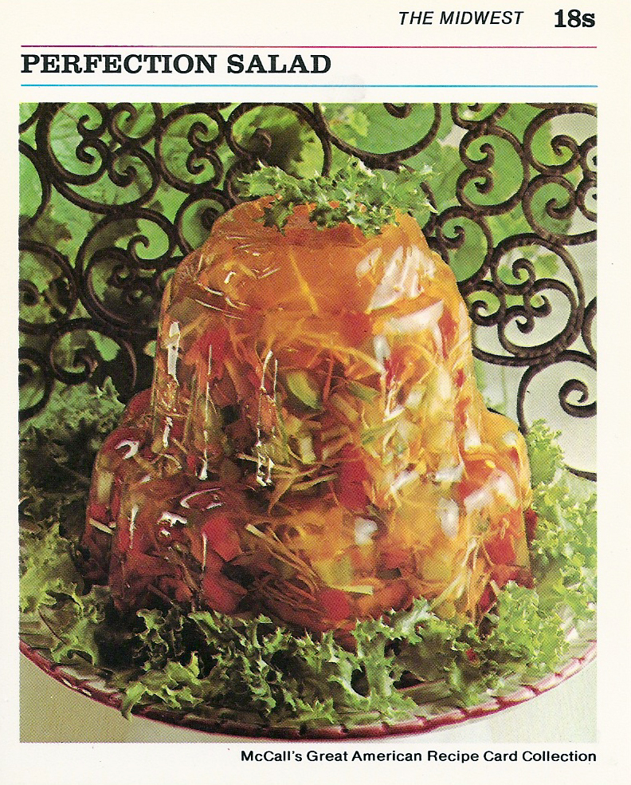

# Perfection Salad

This is a great recipe my mom got from my aunt. She has made it every year for Thanksgiving. It is a family tradition for us. It can be made a day or two ahead of time, if you like. It looks just beautiful in a cut crystal bowl. Thanksgiving is not the same without it for us! We just 'gobble' it up! Chopped walnuts can be substituted for chopped pecans.

- [ ] 2 envelopes unflavored gelatine
- [ ] 1/2 cup sugar
- [ ] 1 teaspoon salt
- [ ] 1 can (12 oz) apple juice
- [ ] 1/2 cup lemon juice
- [ ] 2 tablespoons vinegar
- [ ] 1 cup shredded carrot
- [ ] 1 cup sliced celery
- [ ] 1 cup finely shredded cabbage
- [ ] 1/2 cup chopped green pepper
- [ ] 1 can (4 oz) chopped pimiento

### DirectionsInstructions Checklist
1. In small saucepan, combine gelatine, sugar, and salt; mix well.

1. Add 1 cup water. Heat over low heat, stirring constantly, until sugar and gelatine are dissolved. Remove from heat.

1. Stir in apple juice, lemon juice, vinegar, and 1/4 cup cold water. Pour into medium bowl. Refrigerate 1 hour, or until mixture is consistency of unbeaten egg white.

1. Add carrot, celery, cabbage, green pepper, and pimiento; stir until well combined.

1. Turn into decorative, 1 1/2-quart mold. Refrigerate 4 hours,or until firm.

1. To unmold: Run small spatula around edge of mold; invert onto serving plate. Place hot dishcloth over mold; shake gently to release. Repeat, if necessary. Lift off mold. refrigerate until ready to serve.

_**Makes 8 servings**_
